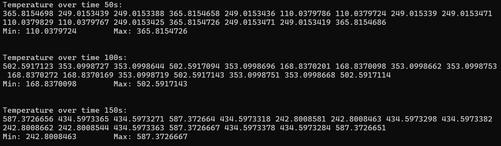
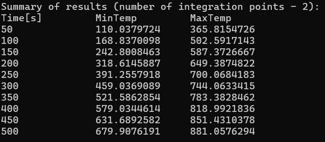

# Finite Element Method

#### The program implements software that handles the problem of unsteady heat transfer in a two-dimensional system using the finite element method.

This is my school project created during the Finite Element Method subject. It was written in C++.

The repository contains files with input data for the program. They contain the necessary data for conducting the simulation (e.g. temperature or material properties) and the coordinates and arrangement of nodes in the element.

The program can be customized by selecting the integration scheme (two-, three- or four-point), which in the case of irregularly shaped elements affects the accuracy of the results.

The result of the program is the temperature distribution in the nodes of the element in each time step. 

For readability, the minimum and maximum temperature of the nodes after each time step is printed at the end.

